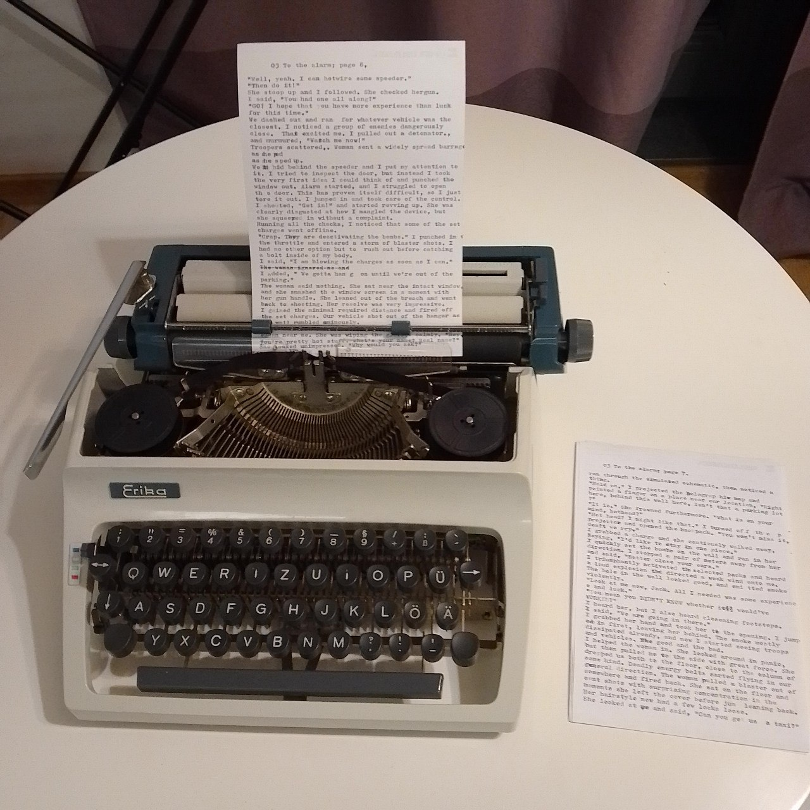

# Awakening
### The overkill for a first semester project.

## README contents:

1. General information
2. Formatting, files and code notes
3. Diagram
4. Copyleft


## 1. General information

### 1.1. Kurzgesagt

An open-source game. Virtually any story consisting of text and choices can be assembled from this.

I wrote most of the story on the typewriter in the evening inspiration impulses.

### 1.2. How to run?

The code has to be compiled. I can provide two examples of how to do that.

### 1.2.2. Visual Studio

Open the **main.c** in **Visual Studio** and Run it. After that, the **.exe** that was created in the project folders can be used. I suppose. If it can find its way. Because the program must be in the directory that contains the story directories and the default story directory.

### 1.2.3. gcc

In the directory containing **main.c**, run in the terminal the following command:
`gcc -o main main.c`
Then, run the following:
`./main`
The file main shall be executable.
Just as it was explained in the **Visual Studio** approach, it has to be in the directory containing the story directory tree.


## 2. Formatting, files and code notes

### 2.1. File structure tree

The program is designed to manage trees of directories. Directories **have** to have **one-symbol** filenames. The path is designed so that it can be read this way.

This: 
```
./0/
    text.txt
    anything.any
    a/
        5/
            title.txt
            options.txt
        text.txt
```
is ought to work.


This:
```
./0/
    text.txt
    ba/
        title.txt
    directory/
        text.txt
        options.txt
    e/
        text.txt
        title.txt
        options.txt
```     
shall only work. But only contents of ./0/ or ./0/e/ can be read.         


### 2.2. Why ./0/ ?

No reason. 
It is written in **#define** as a default, obligatory folder to start from. 
It can be changed to any other one-letter path, given that the **#define** is edited and the directory exists in the executable file's directory.


### 2.3. Files.

It is planned so that each story node can consist of **title**, **text** and **options**.

"title.txt": Has a title; it is printed before "text.txt".
"text.txt: Intended to keep the main text. printed after the "title.txt" and before "options.txt".
"options.txt": Keeps a list of options.
    -   One option per line.
    -   Format : "<redirect **filecode**>:<option title>"
        -   <redirect **filecode**> is a series of symbols, each representing a directory name.
        -   : is a colon. It is a separator between the filecode and the option title.
        -   <option title> is the only thing from the file that shall be printed to the user.
    -   Virtually, any amount of options is acceptable.
    -   <redirect filecode> is read as anything that comes before the colon ':' in the line. It can redirect anywhere, but the filecode must start from the default folder.
    -   <option title>  can contain any text, even colons - only the first colon in the line shall be read as a separator.

If any of the files is missing, it is skipped. It is used for story structure:
    -   No title:   Mystery. Or just continuation.
    -   No text:    Only the options and the title. Or only the options.
    -   No options: The ending of the story path. There is no redirecting from there.

Filenames can be altered in **#defines**.
More filetypes can be added.


### 2.4. filecode

**filecode** is a string (char*) consisting of symbols, each representing a local path part.

"0": Default, starting **filecode**.
"012A1": Starting from "0", (meaning ./0), it shall represent such path: ./0/1/2/A/1/

**Redirects** can redirect to anywhere in the story, but they can not represent local paths from the **nodes**.

If the program is on the **node** 022 and path 54 is chosen, the program changes the directory to ./5/4 and reads from it. It shall not change to ./0/2/2/5/4.

### 2.5. Story node

The term for a bit of story. It must be understood as an object containing all or any of the text files and having a **filecode** that represents a path. Thought it is not an object.

### 2.5. External path? Non-one-letter foldernames?

Yeah, no... not yet. Those features are not supported.


## 3. Diagram

A **UML** diagram that describes the algorithm. Can be opened with **UMLet** on **Linux** machines.


## 4. Copyleft

The program can be copied and modified. 
Author should be mentioned in any readable form. (No, really. Using the ciphers is fine.)
Commercial usage is **prohibited** _like alcohol in the twenties_.


## Created by Viacheslav Pihida, Revenge-of-Shadow on GitHub; 28.11.2024


hehehehe sleep is deprecated
